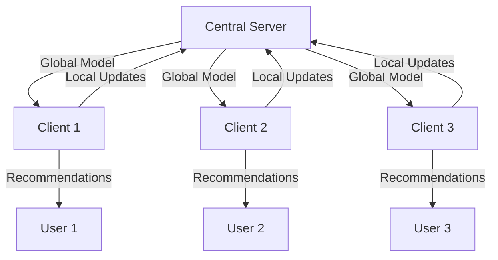

# Tag-Aware Federated Recommender System Design

## 0. Problem

How can we recommend content to users while maintaining privacy?

Federated learning is a way to learn locally (e.g. company or individual), while still being able to 
learn globally. 

## 1. System Architecture

Here's a very high level view of how a federated recommender works:

## 2. Implementation Steps

### 2.1 Data Preparation
- Use the MovieLens 20M Dataset
- Preprocess the data:
  - Clean the dataset
  - Handle missing values
  - Extract relevant features (user IDs, item IDs, ratings, tags)

### 2.2 Tag-Aware Recommender System
1. Feature Extraction:
   - Create item-tag matrix
   - Generate user-item interaction matrix
   - Develop tag-based user profiles

2. Neural Network Model:
   - Design a neural network architecture for collaborative filtering
   - Incorporate tag information into the model

3. Training:
   - Split data into training and testing sets
   - Train the model on the training data

4. Evaluation:
   - Use Mean Squared Error (MSE) to evaluate model performance
   - Implement additional metrics if needed (e.g., precision, recall)

### 2.3 Federated Learning Setup
1. Client Setup:
   - Implement 3-4 clients, each with a subset of the dataset
   - Ensure data privacy by keeping data local to each client

2. Server Setup:
   - Implement a central server to coordinate the federated learning process
   - Use Flower framework for federated learning coordination

3. Federated Training Process:
   - Initialize global model on the server
   - For each round of federated learning:
     a. Send global model to clients
     b. Clients train on local data
     c. Clients send model updates to server
     d. Server aggregates updates and updates global model

4. Model Aggregation:
   - Implement FedAvg or a similar aggregation algorithm on the server

### 2.4 Integration and Testing
1. Combine Tag-Aware Recommender with Federated Learning:
   - Adapt the tag-aware recommender to work in the federated setting
   - Ensure proper data handling and model updates

2. End-to-End Testing:
   - Test the entire system with multiple clients
   - Verify recommendations and privacy preservation

3. Performance Evaluation:
   - Compare federated tag-aware recommender performance with centralized version
   - Analyze impact on recommendation accuracy and privacy

## 3. Technologies and Frameworks
- Python for implementation
- PyTorch or TensorFlow for neural network modeling
- Flower framework for federated learning
- Pandas for data manipulation
- Scikit-learn for evaluation metrics

## 4. Privacy Considerations
- Ensure no raw data leaves client devices
- Implement secure aggregation if needed
- Consider differential privacy techniques for enhanced privacy

## 5. Scalability and Future Improvements
- Design system to handle larger datasets and more clients
- Consider implementing more advanced federated learning techniques (e.g., FedProx, FedOpt)
- Explore personalization techniques within the federated learning context